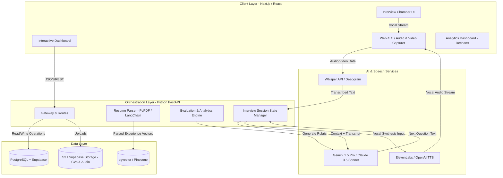
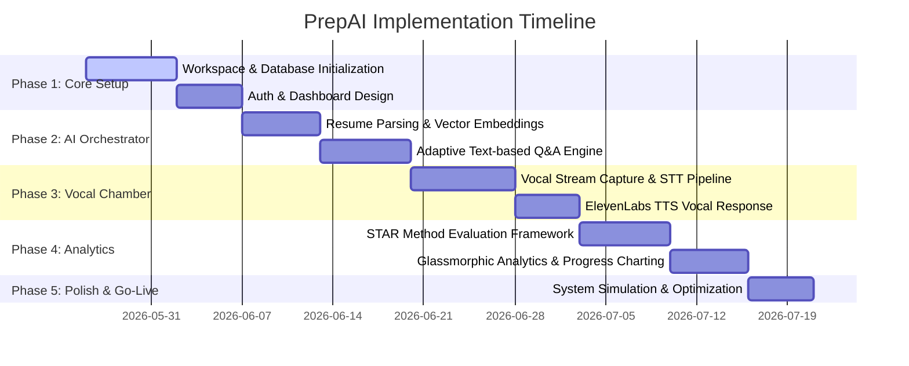

# AI Interview Preparation System (PrepAI)
## Comprehensive Technical & Strategic Project Plan

PrepAI is a state-of-the-art, AI-powered interview preparation system designed to give candidates a realistic, interactive, and feedback-rich mock interview experience. Through conversational AI, speech-to-text translation, facial/emotion sentiment analysis, and multi-dimensional performance tracking, PrepAI bridges the gap between raw preparation and real-world execution.

---

## 1. Project Overview & Core Vision

Standard interview prep platforms are static Q&A databases. PrepAI introduces **dynamic interaction** and **multimodal analytics**:
*   **Adaptive Interviewers**: Non-deterministic AI interviewers that react to candidate answers, ask probing follow-up questions, and adapt their tone/stress-level based on settings.
*   **Resume-Tailored Tracks**: AI parses the candidate's PDF resume, extracts skills/experience, and targets specific tech stacks or behavioral competencies matching the target job description.
*   **Vocal & Visual Analytics**: Real-time evaluation of filler words (e.g., *um*, *like*, *ah*), voice pacing, facial expressions (optional feature), and semantic correctness.
*   **Actionable Scorecards**: Granular performance breakdowns based on rubric markers (e.g., problem-solving, communication clarity, technical depth, structure like STAR method).

---

## 2. System Architecture & Data Flow

PrepAI utilizes a modern, decoupled three-tier architecture optimized for real-time media streaming, low-latency LLM completions, and secure analytics storage.

### High-Level System Architecture



---

## 3. High-Fidelity Design System & UI Guide

To command a premium feel, PrepAI will employ a modern **Dark Glassmorphic UI** layout, enriched with vibrant fluid gradients, reactive animations, and clean, high-readability typography.

### Design Tokens

| Property | Token / Spec | Visual Treatment |
| :--- | :--- | :--- |
| **Primary Theme** | Dark Mode First | Deep Cosmic Charcoal (`#09090B`) to Rich Space Indigo (`#0F0F1A`) |
| **Accent Colors** | Neon Teal (`#06B6D4`), Hyper Violet (`#8B5CF6`), Emerald Glow (`#10B981`) | Used for highlights, success ratings, and interactive borders |
| **Base Typography** | Sans-Serif | Headings: `Outfit` or `Cabinet Grotesk` \| Body: `Inter` (variable-weight) |
| **Code / Technical** | Monospace | `JetBrains Mono` or `Fira Code` for terminal logs and coding answers |
| **Cards & Panels** | Glassmorphism | Semi-transparent background, subtle blur, fine neon borders |

```css
/* Core Glassmorphic CSS Implementation Blueprint */
.glass-panel {
  background: rgba(15, 15, 26, 0.65);
  backdrop-filter: blur(12px) saturate(180%);
  border: 1px solid rgba(255, 255, 255, 0.08);
  box-shadow: 0 8px 32px 0 rgba(0, 0, 0, 0.37);
  border-radius: 16px;
  transition: all 0.3s cubic-bezier(0.4, 0, 0.2, 1);
}

.glass-panel:hover {
  border-color: rgba(6, 182, 212, 0.3); /* Accent teal glow on hover */
  box-shadow: 0 12px 40px 0 rgba(6, 182, 212, 0.15);
}
```

---

## 4. Product Roadmap & Phased Execution



---

## 5. Technical Specifications & Database Schema

We will use a relational model (PostgreSQL) optimized for relational integrity between users, resumes, interview runs, and structured feedback records.

### Database Entity Relational Model

```
   ┌───────────┐         1 : N         ┌──────────────┐
   │   User    │ ────────────────────> │    Resume    │
   └───────────┘                       └──────────────┘
         │
         │ 1 : N
         ▼
   ┌──────────────┐      1 : N         ┌───────────────────┐
   │  Interview   │ ─────────────────> │ CandidateResponse │
   │   Session    │                    └───────────────────┘
   └──────────────┘                              │
         │                                       │ 1 : 1
         │ 1 : 1                                 ▼
         │                               ┌───────────────────┐
         └─────────────────────────────> │ SessionEvaluation │
                                         └───────────────────┘
```

### Table Definitions (TypeScript Prisma Syntax)

```prisma
// User profile model
model User {
  id            String             @id @default(uuid())
  email         String             @unique
  name          String?
  createdAt     DateTime           @default(now())
  resumes       Resume[]
  sessions      InterviewSession[]
}

// Resume model representing candidate credentials
model Resume {
  id            String             @id @default(uuid())
  userId        String
  user          User               @relation(fields: [userId], references: [id], onDelete: Cascade)
  fileUrl       String
  parsedText    String             @db.Text
  skills        String[]           // Extracted skills
  targetRoles   String[]
  createdAt     DateTime           @default(now())
}

// Single mock interview run
model InterviewSession {
  id            String             @id @default(uuid())
  userId        String
  user          User               @relation(fields: [userId], references: [id], onDelete: Cascade)
  roleTitle     String             // e.g. "Senior Backend Engineer"
  difficulty    Difficulty         @default(INTERMEDIATE)
  persona       Persona            @default(STANDARD) // FRIENDLY, TECHNICAL, STRESSFUL
  status        SessionStatus      @default(ONGOING)  // ONGOING, COMPLETED
  transcript    Json[]             // Array of conversation messages
  responses     CandidateResponse[]
  evaluation    SessionEvaluation?
  createdAt     DateTime           @default(now())
}

// Specific question/answer exchange in a session
model CandidateResponse {
  id            String             @id @default(uuid())
  sessionId     String
  session       InterviewSession   @relation(fields: [sessionId], references: [id], onDelete: Cascade)
  questionText  String             @db.Text
  answerText    String             @db.Text
  durationSec   Int
  fillerCount   Int                // Number of filler words detected
  score         Float?             // Sub-score out of 10.0
  critique      String?            @db.Text
  createdAt     DateTime           @default(now())
}

// Holistic feedback generated at the end of the session
model SessionEvaluation {
  id                 String             @id @default(uuid())
  sessionId          String             @unique
  session            InterviewSession   @relation(fields: [sessionId], references: [id], onDelete: Cascade)
  technicalScore     Float              // Score 0.0 - 10.0
  communicationScore Float              // Score 0.0 - 10.0
  behavioralScore    Float              // Score 0.0 - 10.0
  overallScore       Float              // Average weighted score
  summary            String             @db.Text
  actionableTips     String[]
  createdAt          DateTime           @default(now())
}

enum Difficulty {
  ENTRY
  INTERMEDIATE
  SENIOR
}

enum Persona {
  FRIENDLY
  STANDARD
  TECHNICAL
  STRESSFUL
}

enum SessionStatus {
  ONGOING
  COMPLETED
}
```

---

## 6. Granular Implementation Checklist

### Phase 1: Foundations & Setup
- [ ] Initialize repository structure with standard directories (Vite React Client and FastAPI Server).
- [ ] Setup Docker Compose file for local PostgreSQL instance or configure Supabase connection keys.
- [ ] Build global CSS styling library (`index.css`) containing dark-theme variables, font imports, and glassmorphic layouts.
- [ ] Code authentication flow (JWT/OAuth) featuring secure sessions and protected route redirects.

### Phase 2: Resume Parser & AI Dynamic Session
- [ ] Develop FastAPI endpoint utilizing PDF-extractors to pull clean text from resumes.
- [ ] Use LangChain/Semantic parsers to structure parsed resumes into actionable skills and project descriptors.
- [ ] Build the dynamic Interview Prompt Generator using system prompts that match chosen Difficulty and Interviewer Persona parameters.
- [ ] Deploy dynamic text-chat mockup to verify conversation flows, branch management, and user contextual recall.

### Phase 3: Vocal Chamber & Real-Time Audio Engine
- [ ] Implement browser-based WebAudio API recording hooks supporting variable stream packet boundaries.
- [ ] Configure low-latency Speech-to-Text connection pipeline using Whisper API/Deepgram.
- [ ] Integrate ElevenLabs/OpenAI TTS dynamic text-to-voice synthesizers to stream spoken questions back to client.
- [ ] Code sound wave dynamic visualizer using standard canvas frames to animate voice waves matching user and system audio levels.

### Phase 4: Assessment Metrics & Interactive Analytics
- [ ] Program filler word detection engine parsing audio transcript arrays for markers (`uh`, `um`, `like`, `so`).
- [ ] Develop Final Grading LLM prompt parsing entire session transcript and referencing structured scoring criteria (STAR response model).
- [ ] Build multi-dimensional glassmorphic dashboard showcasing radar, line, and bar charts representing candidate progress over time.
- [ ] Add searchable past scorecard archives with direct audio playback and highlighted, timestamped transcript sections.

---

## 7. Critical Risks & Mitigation Strategy

1.  **Vocal Stream Latency (Risk)**: High-latency transitions between user ending speech, API conversion, and LLM text generation can ruin immersion.
    *   *Mitigation*: Implement real-time WebSockets to stream audio directly. Use highly responsive, smaller LLMs (e.g. Gemini Flash or GPT-4o-mini) for speech turn-taking and run full evaluations asynchronously after the interview completes.
2.  **Resume Parsing Noise (Risk)**: Complex PDF double-column styling can lead to disorganized text parsing, damaging context initialization.
    *   *Mitigation*: Force layout-aware extractors or introduce a quick text edit panel allowing users to preview and adjust parsed text before session startup.
3.  **LLM Topic Drifting (Risk)**: Candidate might answer out-of-bounds questions or attempt prompt injection.
    *   *Mitigation*: Rigid System Prompts outlining boundary scopes, enforcing strict roleplaying parameters, and rejecting conversation shifts unrelated to the target role.
